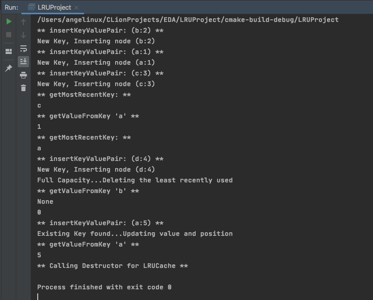

# LRU Cache Project

## Enunciado del problema
Implementar una  LRUCache para Least Recently Used (LRU) cache. La clase debe soportar:

* Insertar pares key-value con el método **insertKeyValuePair**
* Recuperar value de un key con el método **getValueFromKey**
* Recuperar el key más recientemente usado con el método **getMostRecentKey**

Cada uno de estos métodos debe ejecutarse en tiempo constante.

## Análisis y Diseño del Algoritmo

### Elección de las Estructura de Datos
Dada la restricción de implementar los métodos en tiempo constante O(1) es importante elegir la estructura **unordered_map**. <br>
Hay una diferencia importante en terminos de eficiencia entre usar *map* y *unordered_map*, ya que un *map* es implementado como una estructura de *"árbol balanceado"*, motivo por el cual es posible mantener el orden entre sus elementos. Dada esta característica el Time Complexity de las operaciones en un *map* son O(lg n). Por otro lado un *unordered_map* es implementado internamente usando un *"Hash Table"* donde las key están hasheados a los índices del Hash Table, logrando que en promedio el costo de operaciones de **search**, **insert** y **delete** sean O(1). Por lo tanto, dado el constraint del problema O(1) la elección del **unodered_map** es la que se utilizará.

Por otro lado, la funcionalidad del LRU Cache, requiere que podemos mantener un track del elemento que menos ha sido accesado (LRU) y desalojarlo si necesario (cuando alcanza el tamaño máximo y es necesario otro ejecutar un insert). <br>
Para mantener este track de orden de los elementos es útil el uso de una **Doubly Linked List** con el cual podemos intercambiar los elementos en O(1) si previamente podemos accesar directamente a la posición del nodo.

Entonces para la solución de este problema haremos uso de estas 2 estructuras de datos. Almacenaremos los keys en un Hash Tabler **unordered_map** y como value tendremos un puntero hacia un Objeto tipo Nodo de la **Doubly Linked List**. <br>
Con estas estructuras podemos acceder de forma eficiente a un par Key:Value gracias al Hash Table del unordered_map y podemos mantener un track del elemento más recientemente usado (Head) y el menos recientemente usado (Tail) con el uso de la Doubly Linked List, donde podemos hacer un swap entre el head y el elemento consultado de forma eficiente para mantener el tracking de acceso de los elementos.

## Implementación
A continuación se muestra de forma general los aspectos más importantes de la implementación.

### Clases
#### Clase LRUCache
La clase principal de la estructura LRUCache esta definida en el archivo *LRUCache.h*, donde es importante destacar el uso de **unordered_map** para almacenar los keys y como value tenemos punteros hacia Objetos de tipo *Node* donde se almacenarán tanto el key como el value. El objeto LRUCache tambien esta compuesto por una **Doubly Linked List** al cual accedemos mediante un puntero llamado *dll*

``` cpp
template <class T1, class T2>
class LRUCache : public ICache<T1, T2> {
private:
    int currentSize;
    int maxSize;
    std::unordered_map<T1, Node<T1, T2>*> mapCache;
    DoublyLinkedList<T1, T2>* dll;
public:
    explicit LRUCache(int capacity);
    ~LRUCache();
    T1 getMostRecentKey();
    T2 getValueFromKey(T1 key);
    void insertKeyValuePair(T1 key, T2 value);
    void updatePositionNode(Node<T1, T2>* node);
    void print();
    void explainAnalyze();
};
```
* Los métodos *getMostRecentKey, getValueFromKey, insertKeyValuePair* son los solicitados de acuerdo al enunciado del problema para el LRUCache. <br>
* El método *updatePositionNode* se encarga de hacer un swap entre el *Node* y el *Head* de la Lista Enlazada. Esto ocurre cuando se consulta por el valor de un key mediante el método *getValueFromKey* de esta forma tenemos como resultado que en el *Head* de la lista esta el elemento más recientemente consultado y en *Tail* de la Lista el menos consultado.
* El método *print* simplemente itera sobre la estructura mapCache e imprime el key y value almacenado (en desorden) y el método *explainAnalyze* (inspirado en una función de PostgreSQL que lleva el mismo nombre) implementa una impresión de la estructura de la Lista Enlazada. Ambos métodos solo fueron utilizados para evidenciar el correctado estado de las estructuras.
* Importante mencionar la implementación del Destructor *~LRUCache()* con el cual nos aseguramos de liberar la memoria de todos los objetos *Node* que fueron creados en tiempo de ejecución.
* El acceso a los datos de la estructura estan protegidos mediante la definición en la sección *Private* de esta clase.

#### Clase DoublyLinkedList
La estructura LRUCache hace uso de esta Lista Doblemente Enlazada. Lo interesante de esta lista es que *Self Organized List* gracias al control que tiene sobre esta la clase LRUCache cada vez que recibe peticiones *getValueFromKey*.

``` cpp
template<class T1, class T2>
class DoublyLinkedList {
public:
    Node<T1, T2>* head;     // most recently used
    Node<T1, T2>* tail;     // least recently used
    DoublyLinkedList();
    void push_front(Node<T1, T2>* node);
    void print();
    void printReverse();
};
```

* La implementación de métodos es standard a una Lista Doblemente Enlazada. 
* El *Head* de la lista apunta al nodo más recientemente accesado y *Tail* al nodo menos recientemente usado (candidato a ser eliminado cuando se llega al limite de capacidad del LRUCache)
* Por simplicidad los atributos estan como públicos pero es importante notar que la seguridad de acceso a estos datos es implementado en la clase LRUCache, es decir no se puede acceder a Lista Enlazada que es parte del Objeto LRUCache.

#### Clase Node
Los nodos de la lista enlazada, tienen una implementación standard tal como se muestra.<br>

* El método *killMe()* es invocado por el destructor de la clase *LRUCache* quien llama primero al nodo *Head* quien recursivamente recorre hacia el resto de nodos *(next attribute)* para ejecutar el *delete* una vez alcanzado el *Tail* de la Lista


``` cpp
template<class T1, class T2>
class Node {
public:
    T1 key;
    T2 value;
    Node<T1, T2>* prev;
    Node<T1, T2>* next;
    Node();
    Node(T1 key, T2 value);
    void killMe();
};
```

### Interface
La clase LRUCache es implementado utilizando como Interface la clase *ICache* definido en *ICache.h*. Esta clase abstracta define los 3 métodos que debe implementar la clase LRUCache. Esto permite la posibilidad que otras clases implementen estos métodos de forma distinta (Ejemplo FIFOCache)

``` cpp
template <class T1, class T2>
class ICache{
public:
    virtual T1 getMostRecentKey() = 0;
    virtual T2 getValueFromKey(T1 key) = 0;
    virtual void insertKeyValuePair(T1 key, T2 value) = 0;
    virtual ~ICache() = default;
};
```

### Templates

Inicialmente se implementó la estructura LRUCache con tipos de datos Key(char):Value(int) de acuerdo al enuciado del problema. Sin embargo se incluyó flexibilidad en el tipo de datos mediante el uso de templates

### Ejecución y test
Desde el *main.cpp* creamos una instancia de la clase LRUCache con las siguientes operaciones recibiendo los resultados esperados.

``` cpp
int main() {
    LRUCache<char, int> lruCacheObj(3);
    lruCacheObj.insertKeyValuePair('b', 2);
    lruCacheObj.insertKeyValuePair('a', 1);
    lruCacheObj.insertKeyValuePair('c', 3);
    //lruCacheObj.explainAnalyze();
    std::cout << lruCacheObj.getMostRecentKey() << "\n";    // 'c'
    std::cout << lruCacheObj.getValueFromKey('a') << "\n";   // return 1
    std::cout << lruCacheObj.getMostRecentKey() << "\n";    // 'a'
    lruCacheObj.insertKeyValuePair('d', 4);     // cache maxSize reached; delete lru and update
    std::cout << lruCacheObj.getValueFromKey('b') << "\n";   //  return -1, 'b' was evicted in the previous operation
    //lruCacheObj.explainAnalyze();
    lruCacheObj.insertKeyValuePair('a', 5); // 'a' already exist; update value and position
    //lruCacheObj.explainAnalyze();
    std::cout << lruCacheObj.getValueFromKey('a') << "\n";  // return 5
    //lruCacheObj.explainAnalyze();
    return 0
}
```

A continuación se muestra la salida del terminal 



